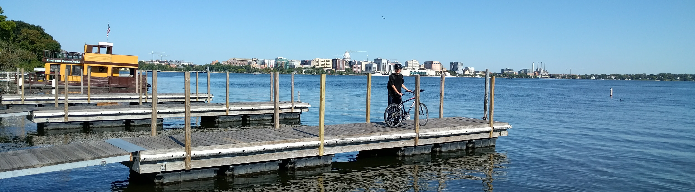
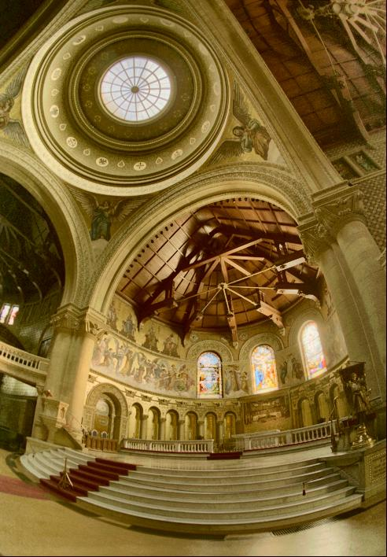

---
[威斯康星大学麦迪逊分校](http://www.wisc.edu/)[电子与计算机工程系](http://www.engr.wisc.edu/ece.html)与[计算机科学系](https://www.cs.wisc.edu/)研究生. 本科毕业于[清华大学](http://www.tsinghua.edu.cn/publish/newthu/index.html)[工程物理系](http://www.tsinghua.edu.cn/publish/ep/index.html). 

- - -
## [学历](#edu)
- 威斯康星大学麦迪逊分校
    - 计算机科学硕士, 2016 - 2017
    - 电子工程硕士, 2015 - 2016
- 清华大学
    - 工程物理学士 2011-2015.
    - 辅修计算机技术.
    - 优秀毕业论文. 导师: [邢宇翔](http://www.tsinghua.edu.cn/publish/epen/1733/2010/20101211172428918347272/20101211172428918347272_.html)

---
## [項目](#prj)
1. [High-dynamic-range Imaging](https://gug11.github.io/HDR/) <!--  -->
1. [Lock-Free Parallel Stochastic Gradient Descent(SGD) on dense data](https://gug11.github.io/parallelSGD/)

---
## [论文](#pub)
1. [Limited-angle Multi-energy CT using Joint Clustering Prior and Sparsity Regularization](http://dx.doi.org/10.1117/12.2214312)    __Huayu Zhang__, Yuxiang Xing. SPIE Medical Imaging, San Diego, USA, 2016 (oral).  \[[paper](papers/CPSR.pdf)\] \[[slides](papers/CPSR_slides.pdf)\]
1. [Reconstruction of Limited-angle Duel-Energy CT Using Mutual Learning and Cross-Estimation (MLCE)](http://dx.doi.org/10.1117/12.2211224)   __Huayu Zhang__, Yuxiang Xing. SPIE Medical Imaging, San Diego, USA, 2016 (poster).   \[[paper](papers/MLCE.pdf)\] \[[poster](papers/MLCE_poster.pdf)\]
1. [Iterative Residual Based Deconvolution Partial Volume Correction for Brain PET-MR](papers/IRD.pdf)   Peng C, __Zhang H__, Wu J, Shao X, Chen Y, Li Q, Fakhr E G, and Ying. ISMRM 23rd Annual Meeting, Toronto, Canada, 2015, 2475.

